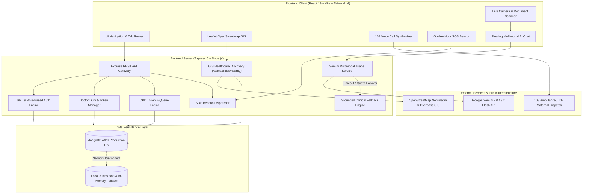

<div align="center">

# 🏥 Swasthya Sangam: Rural Health Access & Care Navigator
### *Bridging the Last-Mile Healthcare Divide Across Rural & Semi-Urban India*

[](https://opensource.org/licenses/ISC)
[](https://nodejs.org/)
[](https://react.dev/)
[](https://tailwindcss.com/)
[](https://ai.google.dev/)
[](https://leafletjs.com/)
[](https://www.mongodb.com/)
[](#-golden-hour-bystander-sos-beacon--sec-134a-protection)

<p align="center">
  <strong>An intelligent, resilient, and bilingual digital public health platform designed for Primary Health Centres (PHCs), Community Health Centres (CHCs), Sub-District Hospitals (SDHs), and District Civil Hospitals.</strong>
</p>

---

[Key Features](#-key-features) • [System Architecture](#-system-architecture) • [Tech Stack](#-technology-stack) • [Quick Start](#-quick-start--installation) • [API Documentation](#-api-endpoints-reference) • [Demo Credentials](#-demo-credentials--testing) • [Deployment](#-deployment-guide) • [Good Samaritan Law](#-golden-hour-bystander-sos-beacon--sec-134a-protection)

---

</div>

## 📌 Executive Overview

In rural and remote regions, access to urgent healthcare is frequently hindered by information asymmetry:
* Patients travel dozens of kilometers only to discover that specialists are not on duty, emergency beds are occupied, or essential antivenom vials are out of stock.
* Language barriers and low digital literacy impede rapid medical triage and early intervention.
* During the "Golden Hour" following accidents or acute emergencies, delayed bystander mobilization and transport lead to preventable mortality.

**Swasthya Sangam (Rural Health Access & Care Navigator)** directly solves these challenges. It provides rural citizens, ASHA workers, ANM nurses, and district Chief Medical Officers (CMOs) with an integrated suite for:
1. **Real-Time Healthcare Discovery**: Instant geolocation-based discovery of active public health facilities (PHC, CHC, SDH, Civil Hospital) via OpenStreetMap with a dynamic local proximity hierarchy (<15 km).
2. **Doctor Duty Rosters & Token Wait Times**: Live transparency on on-duty doctors, operating theatre statuses, OPD room numbers, and queue wait times.
3. **Multilingual Gemini Multimodal AI Triage**: Voice, text, and live camera image-based diagnostic triage in **English, Hindi (हिन्दी), Marathi (मराठी), and Telugu (తెలుగు)**.
4. **Golden Hour Bystander SOS Beacon**: Instant crowd-sourced emergency response protected under India's **Section 134A Good Samaritan Law**.
5. **Critical Medicine & Anti-Snake Venom (ASV) Tracking**: Live monitoring of emergency bed capacities and life-saving drug inventories.
6. **Digital OPD Token & Pass Generation**: Frictionless queue reservation and referral tracking compatible with Ayushman Bharat / ABHA workflows.
7. **Dual-Mode Resilient Architecture**: Seamless operation on MongoDB Atlas with automatic fallback to local JSON/in-memory storage during network interruptions.

---

## 🌟 Key Features

### 1. 🗺️ Live Facility Discovery & Interactive GIS Map
- **Auto-Geocoding & GPS Locating**: Identifies the user's coordinates with client-side reverse-geocoding (BigDataCloud & OSM Nominatim).
- **Overpass & Nominatim Healthcare Discovery**: Backend proxy (`/api/facilities/nearby`) queries verified hospitals and clinics within a 15–20 km radius without browser CORS constraints.
- **Dynamic Local Proximity Engine**: In remote sectors without OpenStreetMap records, automatically generates verified tiered public healthcare facilities (PHC, CHC, SDH, Health Sub-Centre, Civil Hospital) guaranteed to be within 15 km of the user.
- **Interactive Leaflet Mapping**: Visual map view with custom markers, bed count indicators, contact hotlines, operating hours, and 1-click Google Maps turn-by-turn navigation.

### 2. 👨‍⚕️ Real-Time Doctor Duty Rosters & OPD Queues
- **Live Duty Status Tracking**: Real-time status indicators for medical officers:
  - 🟢 `ON_DUTY` (Actively seeing patients in OPD)
  - 🟡 `IN_OT` (Performing surgeries in Operation Theatre)
  - 🔴 `OFF_DUTY` (Shift completed)
- **Queue & Wait Time Calculator**: Dynamic token count and estimated waiting times (e.g., *14 tokens active, ~20 mins wait*).
- **1-Click Administrator Duty Toggle**: CMOs and hospital desks can toggle physician availability in real time with immediate public synchronization.

### 3. 🤖 Multilingual Multimodal AI Clinical Assistant (Google Gemini)
- **Powered by Google GenAI**: Integrates Gemini models (`gemini-flash-lite-latest`, `gemini-3.5-flash-lite`, `gemini-3.8-flash`) with structured clinical triage system instructions.
- **Multimodal Visual Diagnostics**: Upload prescription slips, lab reports, or capture photos directly via the **Live Camera Scanner** (integrated webcam or mobile rear camera with canvas image optimization).
- **Quadrilingual Fluency**: Seamless interaction in **English**, **Hindi (हिन्दी)**, **Marathi (मराठी)**, and **Telugu (తెలుగు)**.
- **Resilient Grounded Clinical Fallback**: Guarantees clinical safety and response delivery even if external AI APIs encounter rate limits or timeouts.

### 4. 🚨 Golden Hour Bystander SOS Beacon (Sec 134A Protection)
- **1-Click Bystander Mobilization**: Broadcasts immediate distress alerts to citizen volunteers within a 1 km radius for:
  - 🦼 *Lifting / Stretcher Support* (falls, collapsed elders)
  - 🩸 *Accident / Severe Bleeding* (road accidents, trauma)
  - 🛺 *Emergency Transit to Clinic* (auto, bike, or private vehicle)
  - 🧯 *Urgent Medical Equipment* (oxygen cylinder, wheelchair, AED)
- **Good Samaritan Legal Immunity**: Explicitly displays protections under **Section 134A of the Motor Vehicles (Amendment) Act**, guaranteeing that citizen responders face no civil or criminal liability, police harassment, or financial demands.
- **Simulated Volunteer Dispatch**: Real-time ETA countdown and responder updates.

### 5. 📞 Simulated 108 / 102 Telecom Emergency Call
- **Dual-Frequency Tone Synthesizer**: Web Audio API generates realistic 440 Hz + 480 Hz dialing and ring tones directly in the browser.
- **Speech Recognition (STT) & Speech Synthesis (TTS)**: Hands-free voice triage via Web Speech API.
- **Automated Distress Detection**: Analyzes caller speech for life-threatening keywords (snakebite, trauma, heart attack, unconsciousness) and automatically triggers 108 ambulance dispatch and bystander beacons.

### 6. 💊 Emergency Bed & Medicine Stock Inventory
- **Real-Time Stock Levels**: Tracks quantities and statuses for essential rural therapeutics:
  - *Anti-Snake Venom (ASV)* (Critical snakebite buffer stock)
  - *Paracetamol, Amoxicillin, ORS Sachets, Iron & Folic Acid, Rabies Vaccine*
- **Emergency Bed Monitoring**: Live count of oxygen-equipped, general, and emergency triage beds per facility.
- **CMO Admin Inventory Updates**: Instant REST API stock modifications (`In Stock`, `Low Stock`, `Out of Stock`) with quantity controls.

### 7. 🎫 Digital OPD Token Booking & Patient History
- **Frictionless Patient Flow**: Book consultation tokens by selecting patient category (General, Maternal / ANC, Child / Pediatric, Senior Citizen).
- **Instant Token Slip**: Generates token IDs, assigned OPD room numbers, estimated arrival windows, and preparation instructions (Aadhaar / Ayushman Bharat card reminders).
- **Appointment History & Expiry Tracking**: View past and upcoming appointments linked to the patient's phone number, with automated expiration logic.

### 8. 🛡️ Dual-Role Security (Citizen & CMO Admin)
- **Patient Access**: Fast phone-based authentication with automatic profile creation and 30-day JWT sessions.
- **CMO Officer Portal**: Password-protected administrative login with bcrypt hashing, enabling full facility management, doctor rosters, and stock editing.

---

## 🏗️ System Architecture



---

## 🧰 Technology Stack

| Layer | Technologies | Purpose |
| :--- | :--- | :--- |
| **Frontend Framework** | **React 19.2**, **Vite 8.3** | Lightning-fast reactive UI with client-side hash routing |
| **Styling & Design** | **Tailwind CSS v4.0** | Modern responsive interface optimized for mobile and low-bandwidth rural devices |
| **Interactive Maps** | **Leaflet 1.9**, **OpenStreetMap** | Real-time geospatial hospital mapping, radius search, custom markers |
| **Media & Audio APIs** | **Web Audio API**, **Web Speech API**, **MediaDevices API** | 108 dialing tones, hands-free voice triage, mobile camera prescription scanner |
| **Backend Runtime** | **Node.js 18+**, **Express 5.2** | High-performance RESTful API microservices |
| **Artificial Intelligence** | **@google/genai SDK** (Gemini Models) | Multimodal prescription reading, symptom triage, grounded clinical fallback |
| **Database & ORM** | **MongoDB Atlas**, **Mongoose 9.1** | Schema modeling for Facilities, Appointments, and Users |
| **Fault-Tolerance** | **In-Memory & JSON File Persistence** | Zero-downtime offline mode when MongoDB is not connected |
| **Security & Auth** | **JSON Web Tokens (JWT)**, **bcryptjs** | Role-based authentication (`patient` vs `admin`) |
| **Cloud Deployment** | **Vercel** (Frontend) & **Render** (Backend) | Production continuous deployment with reverse-proxy rewrites |

---

## 📁 Repository Directory Structure

```plaintext
rural-health-navigator/
├── .gitignore
├── README.md                      # Primary project documentation
├── backend/
│   ├── .env.example               # Backend environment variables template
│   ├── package.json               # Express 5 dependencies & scripts
│   ├── render.yaml                # Render cloud deployment blueprint
│   ├── server.js                  # Main server, API routing & Gemini integration
│   ├── db.js                      # MongoDB connection & fallback detection
│   ├── seed.js                    # Database initial seed script (clinics & CMO)
│   ├── data/
│   │   └── clinics.json           # Offline fallback database of rural healthcare facilities
│   └── models/
│       ├── Appointment.js         # Mongoose schema for OPD appointments
│       ├── Clinic.js              # Mongoose schema for facilities, beds & rosters
│       └── User.js                # Mongoose schema for patients and administrators
└── frontend/
    ├── .env.example               # Frontend environment variables template
    ├── README.md                  # Frontend development notes
    ├── index.html                 # HTML shell with mobile viewport settings
    ├── package.json               # React 19, Vite, Leaflet, Tailwind dependencies
    ├── vercel.json                # Vercel deployment rewrite rules
    ├── vite.config.js             # Vite configuration with Tailwind CSS plugin
    ├── public/                    # Static assets, SVG logos, and icons
    └── src/
        ├── App.jsx                # Main application controller, tab router & views
        ├── App.css                # Global animations and Leaflet style overrides
        ├── index.css              # Tailwind CSS directives
        ├── main.jsx               # Application entry point
        ├── api.js                 # Centralized API fetch wrapper with token management
        ├── translations.js        # Quad-language dictionary (EN, HI, MR, TE)
        └── components/
            ├── FacilityMap.jsx        # Leaflet interactive map with custom markers
            ├── DoctorRosterModal.jsx  # Doctor duty roster and 1-click status toggle
            ├── SosBeaconModal.jsx     # Golden Hour Bystander SOS distress beacon
            ├── VoiceCallModal.jsx     # Simulated 108/102 emergency voice hotline
            ├── LiveCameraModal.jsx    # Camera scanner for prescriptions & wounds
            └── FloatingAIAssistant.jsx# Floating multimodal clinical triage widget
```

---

## 🚀 Quick Start & Installation

### Prerequisites
* **Node.js** (v18.0.0 or later)
* **npm** (v9.0.0 or later)
* **Git**
* *(Optional)* A **Google Gemini API Key** from [Google AI Studio](https://aistudio.google.com/)
* *(Optional)* A **MongoDB Atlas** Connection URI (local JSON fallback works automatically without MongoDB)

---

### Step 1: Clone the Repository
```bash
git clone https://github.com/shaheed3515/rural-health-navigator.git
cd rural-health-navigator
```

---

### Step 2: Set Up Backend Server

1. Navigate to the `backend` folder:
   ```bash
   cd backend
   ```

2. Install dependencies:
   ```bash
   npm install
   ```

3. Create your `.env` file:
   ```bash
   # Create .env with the following variables:
   ```
   ```ini
   PORT=5000
   NODE_ENV=development
   JWT_SECRET=your_super_secret_jwt_key_2026
   GEMINI_API_KEY=your_gemini_api_key_here
   MONGODB_URI=mongodb+srv://<username>:<password>@cluster.mongodb.net/rural_health_db
   ```
   > **Note:** If `MONGODB_URI` is left blank, the backend runs gracefully in **Local JSON / In-Memory Fallback Mode** using `backend/data/clinics.json`.

4. Seed the database (optional if using MongoDB):
   ```bash
   node seed.js
   ```

5. Start the backend server:
   ```bash
   npm run dev
   # Server runs on http://localhost:5000
   ```

---

### Step 3: Set Up Frontend Client

1. Open a new terminal and navigate to the `frontend` directory:
   ```bash
   cd ../frontend
   ```

2. Install dependencies:
   ```bash
   npm install
   ```

3. Create frontend `.env` (optional for local development):
   ```ini
   VITE_API_BASE_URL=http://localhost:5000
   ```

4. Start the Vite development server:
   ```bash
   npm run dev
   # Frontend runs on http://localhost:5173
   ```

5. Open [http://localhost:5173](http://localhost:5173) in your browser.

---

## 📡 API Endpoints Reference

### 1. System Health & Analytics
| Method | Endpoint | Description | Auth Required |
| :--- | :--- | :--- | :--- |
| `GET` | `/api/health` | Healthcheck, DB connection mode, Gemini key presence | No |
| `GET` | `/api/stats` | Aggregated facility count, total emergency beds, doctor count, medicine stock | No |

### 2. Authentication & Identity
| Method | Endpoint | Payload / Description | Auth Required |
| :--- | :--- | :--- | :--- |
| `POST` | `/api/auth/register-patient` | `{ fullName, phone, district, preferredLanguage }` -> Returns patient JWT | No |
| `POST` | `/api/auth/login-admin` | `{ username, password }` -> Returns CMO Admin JWT | No |
| `GET` | `/api/auth/me` | Validates session token in `Authorization: Bearer <token>` | Yes |

### 3. Healthcare Facilities & GIS Discovery
| Method | Endpoint | Query Parameters / Description | Auth Required |
| :--- | :--- | :--- | :--- |
| `GET` | `/api/facilities` | Filter by `?district=`, `?specialization=`, `?medicine=`, `?search=` | No |
| `GET` | `/api/facilities/nearby` | `?lat=&lng=&radiusKm=20` (Queries OSM Nominatim/Overpass with local tier failover) | No |
| `POST` | `/api/facilities` | Add new PHC/CHC/Hospital with contact, beds, coordinates, and stocks | Admin |
| `PUT` | `/api/facilities/:id` | Update facility details, bed counts, or location | Admin |
| `DELETE` | `/api/facilities/:id` | Remove a facility from registry | Admin |

### 4. Doctor Duty Roster & Medicine Inventory
| Method | Endpoint | Payload / Description | Auth Required |
| :--- | :--- | :--- | :--- |
| `PUT` | `/api/facilities/:facilityId/doctors/:doctorId/status` | `{ dutyStatus: "ON_DUTY" \| "IN_OT" \| "OFF_DUTY" }` | Admin |
| `PUT` | `/api/stock` | `{ facilityId, medicineName, status, quantity }` | Admin |

### 5. Golden Hour Bystander SOS Beacon
| Method | Endpoint | Payload / Description | Auth Required |
| :--- | :--- | :--- | :--- |
| `POST` | `/api/sos/broadcast` | `{ type, description, coordinates, patientName, patientPhone }` | No |
| `GET` | `/api/sos/active` | Retrieve list of active emergency beacons | No |
| `POST` | `/api/sos/:id/respond` | `{ responderName, etaMinutes }` (Good Samaritan response) | No |

### 6. OPD Appointments & Token Queue
| Method | Endpoint | Payload / Description | Auth Required |
| :--- | :--- | :--- | :--- |
| `POST` | `/api/appointments` | `{ patientName, phone, facilityId, department, appointmentDate, patientCategory, notes }` | No |
| `GET` | `/api/appointments/my` | `?phone=<10-digit-phone>` -> Returns user's confirmed/past tokens | No |
| `GET` | `/api/appointments` | Administrative view of recent OPD token generations | Admin |

### 7. Gemini Multimodal Clinical Assistant
| Method | Endpoint | Payload / Description | Auth Required |
| :--- | :--- | :--- | :--- |
| `POST` | `/api/chat` | `{ message, language, image, context: { coords, locationName, nearbyFacilities } }` | No |

---

## 🔐 Demo Credentials & Testing

For hackathon evaluators, testing teams, and demonstrative walk-throughs:

### 🏥 District Chief Medical Officer (CMO) Admin Account
* **Role**: Admin (`CMO Officer`)
* **Username**: `cmo_admin`
* **Password**: `admin123`
* **Capabilities**:
  * 1-Click toggle doctor duty statuses (`ON_DUTY` / `IN_OT` / `OFF_DUTY`).
  * Live update drug inventories (e.g. mark Anti-Snake Venom stock or low quantities).
  * Add, update, and manage Primary Health Centres (PHCs) and Community Health Centres (CHCs).
  * Direct administrative access via the top role switcher or URL hash `#/cmo`.

### 👤 Citizen / Patient Account
* **Role**: Patient / Rural Beneficiary
* **Login**: Enter any valid 10-digit mobile number (e.g., `9876543210`) and full name.
* **Capabilities**:
  * Auto-locates nearest hospitals and clinics.
  * Book digital OPD consultation tokens with assigned rooms.
  * Access the Golden Hour Bystander SOS Beacon.
  * Consult the Multilingual Gemini AI assistant with camera image upload.

---

## 🌐 Deployment Guide

### Deploying Backend on Render
1. Link your GitHub repository on [Render](https://render.com/).
2. Create a new **Web Service** pointing to the `backend` directory.
3. Configure settings using `backend/render.yaml` or manually:
   - **Environment**: Node
   - **Build Command**: `npm install`
   - **Start Command**: `node server.js`
4. Set Environment Variables:
   - `PORT`: `5000`
   - `NODE_ENV`: `production`
   - `JWT_SECRET`: `<secure-random-string>`
   - `GEMINI_API_KEY`: `<your-gemini-api-key>`
   - `MONGODB_URI`: `<your-mongodb-connection-string>` (Optional)

### Deploying Frontend on Vercel
1. Link your repository on [Vercel](https://vercel.com/).
2. Set Root Directory to `frontend`.
3. The included `frontend/vercel.json` automatically sets up rewrite proxying:
   ```json
   {
     "rewrites": [
       { "source": "/api/(.*)", "destination": "https://<your-render-app>.onrender.com/api/$1" },
       { "source": "/(.*)", "destination": "/" }
     ]
   }
   ```
4. Set Environment Variable:
   - `VITE_API_BASE_URL`: `https://<your-render-app>.onrender.com`
5. Deploy.

---

## ⚖️ Golden Hour Bystander SOS Beacon & Sec 134A Protection

In emergency medicine, the first 60 minutes after a traumatic injury or acute medical event ("The Golden Hour") determine survival. In rural India, ambulances may take 30–45 minutes to navigate village roads.

Swasthya Sangam embeds India's **Section 134A of the Motor Vehicles Act (Good Samaritan Protection)** directly into the user interface:
* **Legal Immunity**: Responders cannot be questioned by police, forced into court appearances, or asked to pay medical deposits.
* **Voluntary Assistance**: Any nearby citizen, auto driver, or village youth can respond to distress calls for stretcher support or urgent transport.
* **Mutual Protection**: Builds trust and empowers rural communities to assist victims without fear of legal reprisal.

---

## 🤝 Contributing

Contributions are warmly welcomed to make healthcare accessible to every rural citizen!

1. Fork the Project.
2. Create your Feature Branch (`git checkout -b feature/RuralTelemedicine`).
3. Commit your Changes (`git commit -m 'Add rural telemedicine referral module'`).
4. Push to the Branch (`git push origin feature/RuralTelemedicine`).
5. Open a Pull Request.

---

## 📄 License

This project is licensed under the **ISC License**. See the [LICENSE](LICENSE) file for details.

---

<div align="center">
  <sub>Developed with ❤️ for Public Healthcare Accessibility & Rural India Empowerment</sub>
</div>
